# The AI Delivery Lifecycle
While the **Architecture Diagram** shows _what_ we are building, this **Process Diagram** shows _how_ the team works. It defines the Software Development Life Cycle (SDLC) for probabilistic software.

```mermaid
graph TD
    %% Styles
    classDef human fill:#f9f,stroke:#333,stroke-width:2px,color:black;
    classDef auto fill:#e1f5fe,stroke:#0277bd,stroke-width:2px,color:black;
    classDef gate fill:#fff9c4,stroke:#fbc02d,stroke-width:2px,color:black;

    %% Lanes (Phases)
    %% Note: <br/> inside the quotes forces the box to be taller
    
    subgraph DISCOVERY ["PHASE 1: DISCOVERY (Playground)<br/> "]
        direction TB
        Idea(("💡 Idea"))
        Prompting["✍️ Prompt Engineering<br/>(Manual Tuning)"]:::human
        VibeCheck["👀 Vibe Check<br/>(Does it look ok?)"]:::human
    end

    subgraph ENGINEERING ["PHASE 2: ENGINEERING (Hardening)<br/> "]
        direction TB
        GoldenSet["💎 Create Golden Set<br/>(Define Truth)"]:::human
        Schema["🛡️ Define Schema<br/>(JSON Contract)"]:::human
        Commit["💾 Commit to Git<br/>(Prompt Registry)"]:::auto
    end

    subgraph EVALUATION ["PHASE 3: EVALUATION (The Gate)<br/> "]
        direction TB
        RunEval["📉 Run Auto-Evals"]:::auto
        Check{"🚧 Quality Gate<br/>(Pass/Fail?)"}:::gate
    end

    subgraph PRODUCTION ["PHASE 4: PRODUCTION (The Wild)<br/> "]
        direction TB
        Deploy["🚀 Deploy / Release"]:::auto
        Monitor["📊 Monitor Drift"]:::auto
    end

    %% Flow Connections
    Idea --> Prompting
    Prompting --> VibeCheck
    VibeCheck -- "No" --> Prompting
    VibeCheck -- "Yes" --> GoldenSet
    GoldenSet --> Schema
    Schema --> Commit
    Commit --> RunEval
    RunEval --> Check
    
    Check -- "Fail ❌" --> Prompting
    Check -- "Pass ✅" --> Deploy
    Deploy --> Monitor
    Monitor -.->|Drift Detected| Prompting

    %% Link Styling
    linkStyle 8 stroke-width:3px,stroke:#f44336,color:red;
    linkStyle 9 stroke-width:3px,stroke:#4caf50,color:green;
    linkStyle 11 stroke-width:2px,stroke:#ff9800,stroke-dasharray: 5 5;
```

### Phase 1: Discovery (The Playground)

- **Goal:** Find a prompt that works "well enough" for a prototype.
- **Action:** Manual iteration. The Prompt Steward tweaks instructions and runs ad-hoc tests.
- **Exit Criteria:** The "Vibe Check" passes (subjective approval).

### Phase 2: Engineering (The Hardening)

- **Goal:** Convert "vibes" into engineering artifacts.
- **Action:**
    1. **Golden Set:** We define 20–50 input/output pairs that represent "Truth."
    2. **Schema:** We define the strict JSON structure the model must return.
    3. **Commit:** The prompt is saved to the Registry (Git), not left in a playground.

### Phase 3: Evaluation (The Gate)

- **Goal:** Prevent regression.
- **Action:** CI/CD pipeline runs the new prompt against the Golden Set.
- **The Gate:**
    - **Fail (❌):** Accuracy < 90% or Schema breaks. The deployment is blocked. Back to Phase 1.
    - **Pass (✅):** Metrics meet the SLA. Proceed to deploy.

### Phase 4: Production (The Loop)

- **Goal:** Maintain reliability over time.
- **Action:** The system runs in the wild.
- **Feedback:** If **Drift** is detected (e.g., a model update degrades performance), an alert triggers a new cycle starting at Phase 1.
  

  

### Related Work & Conceptual References

The process diagram above reflects emerging best practices in engineering and governing probabilistic software systems. Similar ideas and frameworks have been explored in both academic research and industry thought leadership:

1. Control-Theoretic AI Governance      
	- Social Responsibility Stack (SRS) by Prof. Otman Basir (University of Waterloo)  
	- Treats AI governance as a closed-loop control problem with sensors, controllers, and actuators.
	- Emphasizes continuous monitoring, drift detection, and structured feedback.
	- [arXiv:2512.16873](https://arxiv.org/abs/2512.16873)
2. Agentic AI Lifecycle Frameworks  
	- AGENTSAFE and related frameworks for agentic systems  
	- Defines iterative cycles of plan → act → observe → reflect.
	- Operationalizes human-in-the-loop governance, evaluation pipelines, and artifact versioning.
3. MLOps & ModelOps Best Practices  
	- Industry practices for managing the full lifecycle of ML/AI systems, including deployment, monitoring, evaluation, and retraining.
	- Aligns with the SDLC approach for probabilistic systems, ensuring reliability and operational observability.  
	- [MLOps on Wikipedia](https://en.wikipedia.org/wiki/MLOps)
	- [ModelOps on Wikipedia](https://en.wikipedia.org/wiki/ModelOps)
4. Reflective Governance for LLMs  
	- Academic and practitioner discussions on embedding feedback loops and drift management in LLM deployments.
	- Highlights socio-technical aspects of controllers and rituals for governance.
5. SDLC for AI/Probabilistic Software  
	- Extends traditional software lifecycle models to probabilistic and agentic systems, emphasizing iterative evaluation, feedback loops, and quality gates.