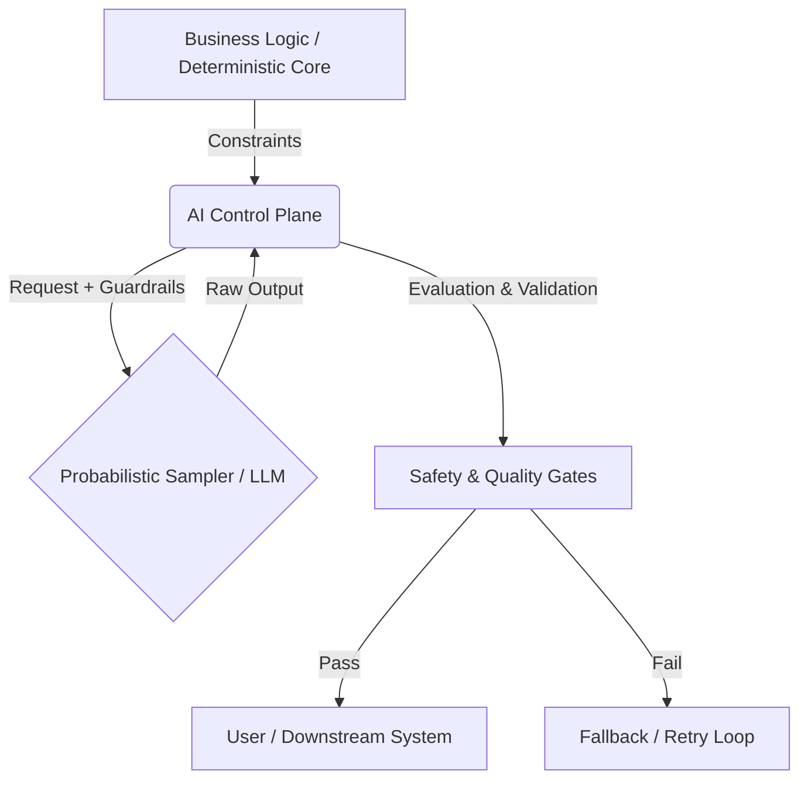

# Uncertainty Architecture: The Operational Standard for AI Governance

> **Uncertainty Architecture** is an engineering framework designed to apply **Control Theory** to probabilistic AI and Agentic AI systems. Unlike traditional software architectures that assume determinism, it introduces layers of strict guardrails, continuous evaluation loops (Golden Sets), and fallback mechanisms to manage the stochastic nature of Large Language Models (LLMs) in enterprise environments.

---

## Overview

Uncertainty Architecture is a high-level model for designing and operating AI systems where outcomes are non-deterministic. It introduces a structured way to reason about uncertainty across development, evaluation, deployment, and governance layers.

The industry is shifting from "Prompt Engineering" to **Deterministic Automation**. This framework provides the operational model for this transition by treating AI Governance not as a policy compliance task, but as a **closed-loop control problem**.

It builds on the idea of an **AI Control Plane** — a management and orchestration layer responsible for coordination, policy enforcement, evaluation loops, and risk-aware decision flows.

## The Stack (Conceptual Model)

The framework is structured around the **AI Control Plane**—a governance layer that separates business logic from probabilistic inference.

## Industry & Academic Validation

This framework is not an isolated theory; it represents a convergence of industry best practices and emerging academic consensus.

### 1. PMI AI Standard Context

The operational principles outlined here have been developed in dialogue with core members of the Project Management Institute (PMI) AI Standard Committee. The framework addresses the specific gap in "AI Risk Management" operationalization identified during standard development discussions.

### 2. Academic Convergence (Control Theory)

Independent academic research has recently confirmed the necessity of a control-theoretic approach to AI Governance.

• Reference: The Social Responsibility Stack (SRS) by Prof. Otman Basir (University of Waterloo), published on arXiv (Dec 2025).

• Convergence: The academic conclusion that "responsibility must be an engineered control loop" mirrors the core thesis of Uncertainty Architecture.

- [Link to arXiv:2512.16873](https://arxiv.org/abs/2512.16873)

### 3. Engineering Consensus

The framework underwent a public stress-test in the Data Science community (Dec 2025), receiving validation from 31000+ engineers(90% Upvote) as a necessary evolution from "vibes-based" development to engineered reliability.

-  https://www.reddit.com/r/learndatascience/s/zLnN4sYftb

## Core Components

1. Strict Guardrails (The Actuators): Deterministic rules that constrain the model's action space before and after generation (Input/Output guarding).
2. Golden Sets (The Sensors): Statistical evaluation datasets used to measure drift and regression in real-time, providing the feedback signal for the control loop.
3. The AI Control Plane: The orchestration layer responsible for routing, retries, versioning (Prompts as Code), and auditability.
4. Fallback Mechanisms: Pre-defined deterministic paths that trigger when uncertainty exceeds the safety threshold.

## Philosophy & Background

Uncertainty Architecture grows from a broader reflection on how modern intelligent systems reshape the conditions of software engineering itself. The ideas behind this framework are explored in the foundational essay:

“The Future, the Mirror and the Book” — Vitalii Oborskyi

• LinkedIn: https://www.linkedin.com/pulse/future-mirror-book-vitalii-oborskyi-7bt2f/

• Medium: https://medium.com/towards-artificial-intelligence/the-future-the-mirror-and-the-book-0085eb181cfa

The essay describes the silent shift from deterministic software to systems built on probabilistic reasoning, the emergence of technogenic uncertainty as a new normal, and the role of institutions in navigating this transition.

“We are building what we cannot fully predict — and our practices must evolve before our systems outgrow our ability to guide them.”

## Goals & Scope

Goals

• Provide a structured conceptual model for handling uncertainty in AI systems.

• Define the relationship between the AI Control Plane and uncertainty-aware architectural layers.

• Establish terminology and diagrams that help engineering, product, and delivery teams build more predictable LLM/AI features.

• Serve as the basis for a future public specification.

Non-Goals

• This repository does not currently contain implementation code (SDKs or libraries).

• It serves as a conceptual definition and governance standard.

• Final operational structures will be published only after partner validation phases.

## Core Research & Chronology
The evolution of this framework has been documented through the following key publications:

• Dec 2025: Community Stress Test (Reddit)

https://www.reddit.com/r/learndatascience/s/zLnN4sYftb

• Dec 2025: Why AI Governance is Actually Control Theory

https://www.linkedin.com/pulse/uncertainty-architecture-why-ai-governance-actually-control-oborskyi-oqhpf/

• Nov 2025: Uncertainty Architecture: A Modern Approach

https://www.linkedin.com/pulse/uncertainty-architecture-modern-approach-designing-llm-oborskyi-keqbf/

• Jul 2025: Architecting Uncertainty: A Modern Guide

https://www.linkedin.com/pulse/architecting-uncertainty-modern-guide-llm-based-vitalii-oborskyi-0qecf/

## Roadmap
This is an active specification project.

• [x] Phase 1: Concept Validation (Completed via Industry Stress-testing)

• [ ] Phase 2: Reference Architecture (Defining the Control Plane specs)

• [ ] Phase 3: Open Source Tooling (Scripts for Golden Set evaluation and Drift Detection)

## Governance & Contributors

Maintainer & Architect:

• Vitalii Oborskyi – Head of Delivery & Operations

https://www.linkedin.com/in/vitaliioborskyi/

Advisory Board:

• Markus Kopko – Strategic Advisor on Governance & Alignment

https://www.linkedin.com/in/markuskleinpmp/

Upcoming Partners:
Strategic partnerships with Collaborative Dynamics and additional key industry co-authors (Sam W.) are currently in the final stages of formalization. The expanded contributor list will be announced in the next release cycle.

## Call for Partners
We are currently moving from concept to pilot phase. I am looking for Engineering Leaders (CTO/VP/Head of Delivery) to implement the Operational Model of Uncertainty Architecture in real-world environments.
If you are building complex Agentic or RAG systems and want to move from "Casino AI" to engineered reliability, let's connect.

Connect: https://www.linkedin.com/in/vitaliioborskyi/
