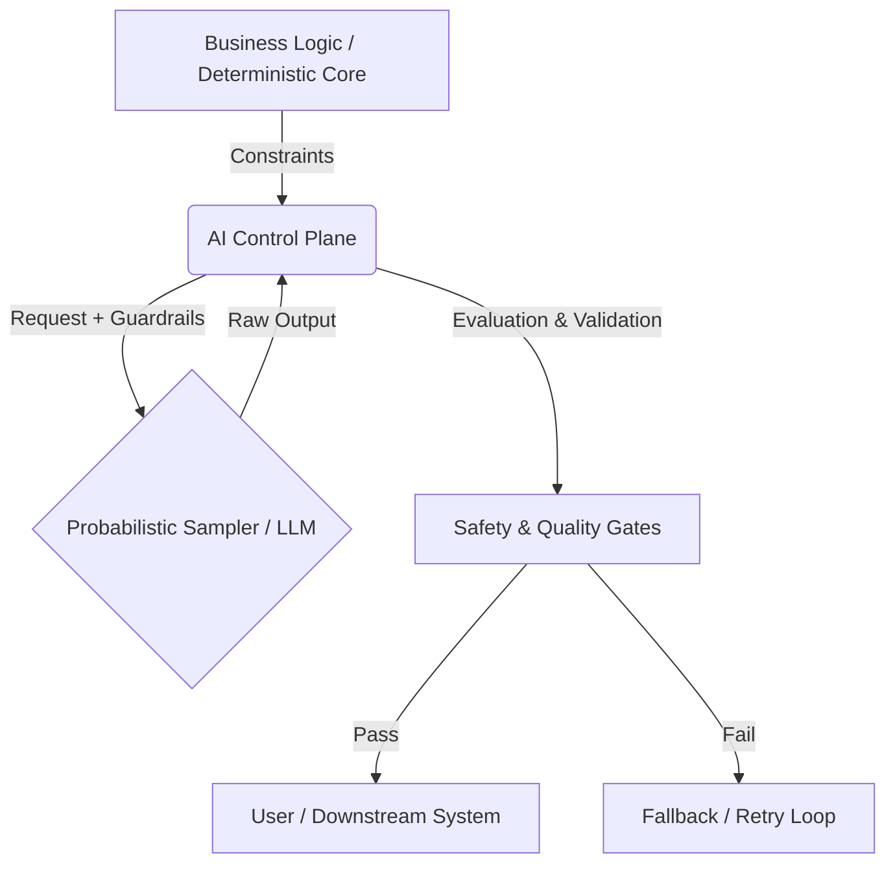

# Uncertainty Architecture: The Operational Standard for AI Governance

> **Uncertainty Architecture** is an engineering framework designed to apply **Control Theory** to probabilistic AI and Agentic AI systems. Unlike traditional software architectures that assume determinism, it introduces layers of strict guardrails, continuous evaluation loops (Golden Sets), and fallback mechanisms to manage the stochastic nature of Large Language Models (LLMs) in enterprise environments.

---

## Overview

Uncertainty Architecture is a high-level model for designing and operating AI systems where outcomes are non-deterministic. It introduces a structured way to reason about uncertainty across development, evaluation, deployment, and governance layers.

The industry is shifting from "Prompt Engineering" to **Deterministic Automation**. This framework provides the operational model for this transition by treating AI Governance not as a policy compliance task, but as a **closed-loop control problem**.

It builds on the idea of an **AI Control Plane** — a management and orchestration layer responsible for coordination, policy enforcement, evaluation loops, and risk-aware decision flows.

---
## Strategic Vision: From Linear to Behavioral Software

While the industry uses the term "Agentic AI," we believe this is a transitional label. The fundamental shift occurring is not just about adding agents; it is the transition from **Linear Applications** to **Behavioral Applications**.

- **Linear Software:** Deterministic, pre-defined paths. The developer explicitly codes *how* the system reaches the result.
- **Behavioral Software:** Probabilistic, goal-oriented. The developer defines the *goal and constraints*, and the system navigates the path dynamically.

**The Mission**

The primary goal of this framework is to provide SMB engineering teams with the necessary operational basis to successfully build, govern, and ship Behavioral Applications.

We aim to bridge the gap where teams try to build non-linear systems using linear methodologies. By introducing Control Theory as the standard for governance, we enable a reality where the industry can safely transition to Behavioral Software as the new default for complex problem 

---

## The Operational Formula

To bridge the gap between deterministic code and probabilistic models, we apply **Control Theory**. We define **AI Governance** not as bureaucracy, but as the engineered feedback loop required to stabilize the system.

> **Reliable AI = Actuators + Sensors + Controller**

This maps abstract control concepts to concrete engineering artifacts:

* **🦾 Actuators (The Execution):** Mechanisms that define and constrain the probability distribution.
    * *Artifacts:* **Prompt Registry**, **Versioned Prompts**, Hyperparameters, and JSON Schemas.
* **📡 Sensors (The Measurement):** Instruments that detect drift and measure the distance from "Business Truth".
    * *Artifacts:* **Golden Sets** (Ground Truth), **Eval Pipelines**, and continuous Drift Monitoring.
* **🧠 Controller (The Governance):** The decision-making logic that adjusts the system based on error signals.
    * *Artifacts:* **The Operating Model**, **Release Gates**, and the Feedback Loop that updates the Registry based on Golden Set performance.


---
## The Stack (Conceptual Model)

The framework is structured around the **AI Control Plane**—a governance layer that separates business logic from probabilistic inference.



---
## Industry & Academic Validation

This framework is not an isolated theory; it represents a convergence of industry best practices and emerging academic consensus.


### 1. PMI AI Standard Context

The operational principles outlined here have been developed in dialogue with core members of the Project Management Institute (PMI) AI Standard Committee. The framework addresses the specific gap in "AI Risk Management" operationalization identified during standard development discussions.

### 2. Academic Convergence (Control Theory)

Independent academic research has recently confirmed the necessity of a control-theoretic approach to AI Governance.

• Reference: The Social Responsibility Stack (SRS) by Prof. Otman Basir (University of Waterloo), published on arXiv (Dec 2025).

• Convergence: The academic conclusion that "responsibility must be an engineered control loop" mirrors the core thesis of Uncertainty Architecture.

- [Link to arXiv:2512.16873](https://arxiv.org/abs/2512.16873)

### 3. Engineering Consensus

The framework underwent a public stress-test in the Data Science community (Dec 2025), receiving validation from 31000+ engineers(90% Upvote) as a necessary evolution from "vibes-based" development to engineered reliability.

-  https://www.reddit.com/r/learndatascience/s/zLnN4sYftb

## Core Components

1. Strict Guardrails (The Actuators): Deterministic rules that constrain the model's action space before and after generation (Input/Output guarding).
2. Golden Sets (The Sensors): Statistical evaluation datasets used to measure drift and regression in real-time, providing the feedback signal for the control loop.
3. The AI Control Plane: The orchestration layer responsible for routing, retries, versioning (Prompts as Code), and auditability.
4. Fallback Mechanisms: Pre-defined deterministic paths that trigger when uncertainty exceeds the safety threshold.

---
## Philosophy & Background

Uncertainty Architecture grows from a broader reflection on how modern intelligent systems reshape the conditions of software engineering itself. The ideas behind this framework are explored in the foundational essay:

“The Future, the Mirror and the Book” — Vitalii Oborskyi

• LinkedIn: https://www.linkedin.com/pulse/future-mirror-book-vitalii-oborskyi-7bt2f/

• Medium: https://medium.com/towards-artificial-intelligence/the-future-the-mirror-and-the-book-0085eb181cfa

The essay describes the silent shift from deterministic software to systems built on probabilistic reasoning, the emergence of technogenic uncertainty as a new normal, and the role of institutions in navigating this transition.

“We are building what we cannot fully predict — and our practices must evolve before our systems outgrow our ability to guide them.”

---
## Goals & Scope

Goals

• Provide a structured conceptual model for handling uncertainty in AI systems.

• Define the relationship between the AI Control Plane and uncertainty-aware architectural layers.

• Establish terminology and diagrams that help engineering, product, and delivery teams build more predictable LLM/AI features.

• Serve as the basis for a future public specification.

Non-Goals

• This repository does not currently contain implementation code (SDKs or libraries).

• It serves as a conceptual definition and governance standard.

• Final operational structures will be published only after partner validation phases.

---
## Core Research & Chronology
The evolution of this framework has been documented through the following key publications:

• Dec 2025: Community Stress Test (Reddit)

https://www.reddit.com/r/learndatascience/s/zLnN4sYftb

• Dec 2025: Why AI Governance is Actually Control Theory

https://www.linkedin.com/pulse/uncertainty-architecture-why-ai-governance-actually-control-oborskyi-oqhpf/

• Nov 2025: Uncertainty Architecture: A Modern Approach

https://www.linkedin.com/pulse/uncertainty-architecture-modern-approach-designing-llm-oborskyi-keqbf/

• Jul 2025: Architecting Uncertainty: A Modern Guide

https://www.linkedin.com/pulse/architecting-uncertainty-modern-guide-llm-based-vitalii-oborskyi-0qecf/

---
## Roadmap
This is an active specification project.

• [x] Phase 1: Concept Validation (Completed via Industry Stress-testing)

• [ ] Phase 2: Reference Architecture (Defining the Control Plane specs)

• [ ] Phase 3: Open Source Tooling (Scripts for Golden Set evaluation and Drift Detection)

---
## Authors & Architects

This standard represents a convergence of two worlds: Enterprise Governance and Advanced System Engineering. It is built on the symbiosis of strict operational control and cutting-edge prompt architecture.

**Vitalii Oborskyi | The Structure & Governance**

Creator & Lead Architect

Responsible for the Operational Model, applying Control Theory to AI risk, and defining the delivery frameworks that make probabilistic systems enterprise-ready. Vitalii provides the architectural constraints and governance logic ensuring the system serves business goals safely.

- Email: oborskyivitalii@gmail.com
- LinkedIn: https://www.linkedin.com/in/vitaliioborskyi/
- GitHub: https://github.com/oborskyivitalii

**Sam "stunspot" Walker | The Intelligence & Foundation**

Technical Co-Author & Lead Systems Architect

Responsible for the Reference Architecture, advanced prompt engineering strategies, and the technical execution of the Control Plane. Sam provides the generative intelligence and functional engine of the framework, defining how the model interprets, reasons, and executes tasks within the architecture.

- Email: stunspot@collaborative-dynamics.com
- Community: Collaborative Dynamics Discord
- LinkedIn https://www.linkedin.com/in/sam-walker-11737518/

---
## Advisory Board & Partnerships

**Markus Kopko** – Strategic Advisor on Governance & Alignment

- LinkedIn: https://www.linkedin.com/in/markuskleinpmp/

### Strategic Partners
Partnerships with Collaborative Dynamics are formalized. Work in progress for UA Framework v0.2.

---

## Call for Partners

We are moving from concept to pilot phase. I am looking for Engineering Leaders (CTO/VP/Head of Delivery) to implement the Operational Model of Uncertainty Architecture in real-world environments.

If you are building complex Agentic or RAG systems and want to move from "Casino AI" to engineered reliability, let's connect.

Connect on LinkedIn: https://www.linkedin.com/in/vitaliioborskyi/

---
## How to Cite

If you use Uncertainty Architecture in your research, architectural documents, or internal wikis, please cite it as follows to ensure proper attribution of the Operational Model.

**Standard Citation:**

Oborskyi, V. (2025). Uncertainty Architecture: An Operational Model for AI Governance. GitHub. [https://github.com/oborskyivitalii/uncertainty-architecture](https://github.com/oborskyivitalii/uncertainty-architecture)

```bibtex
@misc{oborskyi2025uncertainty,
  author = {Oborskyi, Vitalii},
  title = {Uncertainty Architecture: An Operational Model for AI Governance},
  year = {2025},
  publisher = {GitHub},
  journal = {GitHub repository},
  howpublished = {\url{https://github.com/oborskyivitalii/uncertainty-architecture}}
}
```

## Licensing

This repository uses a dual-license model:

- Documentation and specifications are licensed under CC BY 4.0
- Code and reference implementations are licensed under Apache 2.0

See LICENSING.md for details.

---
