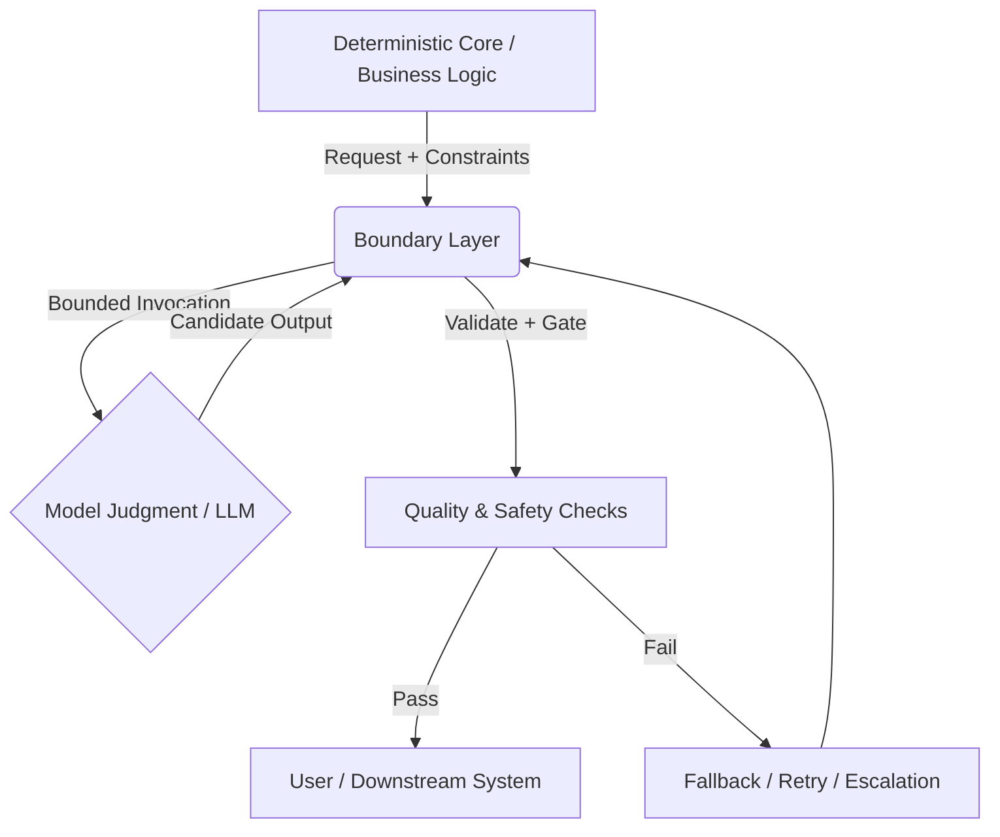

# Uncertainty Architecture (UA): The Operational Open Specification for AI Governance

---

## Engineering at the AI–Code Boundary

**Uncertainty Architecture** is a doctrine and pattern language for building software systems in which part of the system’s behavior is delegated to **non-deterministic model judgment** (LLMs, agentic components, tool-using policies), while the surrounding system remains **deterministic, inspectable, and safe**.

UA is not about eliminating uncertainty or making AI “deterministic.” It is about **containing uncertainty**: deciding where determinism must hold, where judgment is unavoidable, and how the interface between the two is engineered, observed, and corrected over time.

It builds on the idea of an **AI Control Plane** — a management and orchestration layer responsible for coordination, policy enforcement, evaluation loops, and risk-aware decision flows.

---
## Strategic Vision: From Linear to Behavioral Software

While the industry uses the term "Agentic AI," we believe this is a transitional label. The fundamental shift occurring is not just about adding agents; it is the transition from **Linear Applications** to **Behavioral Applications**.

- **Linear Software:** Deterministic, pre-defined paths. The developer explicitly codes *how* the system reaches the result.
- **Behavioral Software:** Probabilistic, goal-oriented. The developer defines the *goal and constraints*, and the system navigates the path dynamically.

**The Mission**

The primary goal of this framework is to provide SMB engineering teams with the necessary operational basis to successfully build, govern, and ship Behavioral Applications.

Teams consistently fail with AI-enabled features for the same reasons:
- They treat model output as if it were a stable API response.
- They embed judgment inside prompts and mistake it for logic.
- They overfit to dashboards and metrics while missing real-world failures.
- They build “agentic” systems without clear boundaries, escalation paths, or fallbacks.

These failures are not caused by stochasticity itself. They occur when teams lack a clear **interface doctrine** between deterministic software and probabilistic judgment.

Uncertainty Architecture exists to fill that gap.

---

## What UA Is — and Is Not

### UA *is*:
- A shared way of **thinking**, **designing**, and **reviewing** systems at the AI–code boundary.
- A collection of **interface patterns** for containment, evaluation, escalation, and fallback.
- A tool-neutral **operational doctrine** grounded in real systems and real failure modes.

### UA is *not*:
- An SDK or universal agent framework.
- A prompt-template pack.
- A single metric or eval that “solves alignment”.
- A compliance checklist or certification program.

UA does not prescribe a platform. It provides **conceptual tools** teams can adapt to their own architecture.

---

## What UA Covers

UA operates at three complementary levels:

### 1. Doctrine (How to Think)
- What model judgment is operationally — and what it is not.
- Where formal specification ends and interpretation begins.
- Why false rigor (over-specified metrics, brittle schemas) fails in practice.

### 2. Patterns (How to Build)
- Boundary patterns between deterministic code and model judgment.
- Containment mechanisms: guardrails, validation, retries, fallbacks.
- Drift detection and structured review loops.

### 3. Operating Model (How to Run)
- Roles and decision points teams actually need.
- Release gates for probabilistic components.
- Incident handling and “battle-scar” feedback.

---

## A Core Principle: Containment, Not Certainty

UA treats AI governance as an **engineering activity**: the design of feedback and containment mechanisms required to operate systems with non-deterministic components.

Control-theoretic ideas inform this work as practical engineering tools:
- Feedback loops.
- Instrumentation.
- Correction mechanisms.

However, UA also recognizes a structural limit: many correctness targets in AI-enabled systems are **interpretive** (usefulness, clarity, appropriateness, policy intent). These cannot be fully reduced to a scalar metric.

For this reason, UA relies on **mixed evaluation**:
- Quantitative signals where they are stable and meaningful.
- Structured human judgment where goals are inherently interpretive.

Metrics are treated as **operational instruments**, not exhaustive definitions of success.

---

## The Operational Formula

To bridge the gap between deterministic code and probabilistic models, we apply **Control Theory**. We define **AI Governance** not as bureaucracy, but as the engineered feedback loop required to stabilize the system.

> **Reliable AI = Actuators + Sensors + Controller**

This maps abstract control concepts to concrete engineering artifacts:

*   **Actuators (The Execution):** Mechanisms that define and constrain the probability distribution.
    *   *Artifacts:* **Prompt Registry**, **Versioned Prompts**, Hyperparameters, and JSON Schemas.
*   **Sensors (The Measurement):** Instruments that detect drift and measure the distance from "Business Truth".
    *   *Artifacts:* **Golden Sets** (Ground Truth), **Eval Pipelines**, and continuous Drift Monitoring.
*   **Controller (The Governance):** The decision-making logic that adjusts the system based on error signals.
    *   *Artifacts:* **The Operating Model**, **Release Gates**, and the Feedback Loop that updates the Registry based on Golden Set performance.

---

## Deterministic Core and Model Judgment

UA makes an explicit distinction between:

- **Deterministic Core:** Business rules, invariants, data handling, authentication, auditing, safety constraints.
- **Model Judgment:** Interpretation, synthesis, classification under ambiguity, open-text generation, tool choice under uncertainty.

The value of UA lies in how these two regions are **connected**, not in attempting to collapse one into the other.

---

## The Boundary Layer (Control Plane Pattern)

UA describes a recurring architectural pattern often referred to here as a **boundary layer** (sometimes called a “control plane” in the literature). This is not a product or platform, but a **pattern vocabulary**.

The boundary layer is responsible for:
- Mediating requests to model judgment.
- Enforcing constraints and permissions.
- Validating and gating outputs.
- Routing retries, fallbacks, and escalation.
- Maintaining versioning and auditability.

It exists to make judgment **visible, bounded, and correctable**.

---

## Evaluation as Instrumentation

UA treats evaluation as instrumentation rather than proof. Common instruments include:
- Regression suites and golden scenarios.
- Red-team and edge-case probes.
- Production monitoring and cost signals.
- Incident tracking and postmortems.
- Qualitative review checkpoints.

No single instrument is sufficient. UA emphasizes **compositional sensing** over metric monoculture.

---

## Conceptual Diagram
The framework is structured around the **AI Control Plane**—a governance layer that separates business logic from probabilistic inference.


   
## Repository Scope & Structure

This repository is a **specification and doctrine project**, organized to reflect the logical flow from theory to implementation.

### Core Framework

- [**📂 00-doctrine/**](./00-doctrine/)
    
    - **Phase 1: Spine.** Core concepts, boundary thinking, and the "Mental Model".
    - _Contains:_ `glossary.md`(Shared language).
- [**📂 01-patterns/**](./01-patterns/)
    
    - **Phase 2: Patterns.**Repeatable interface and containment patterns.
    - _Focus:_ Judgment nodes, hard vs soft invariants, procedural gaskets.
- [**📂 02-ai-control-plane/**](./02-ai-control-plane/)
    
    - **The Implementation Core.**Maps Control Theory to engineering artifacts.
    - [**📂 00-actuators/**](./02-ai-control-plane/00-actuators/) — Prompts & Schemas (The Muscles).
    - [**📂 01-sensors/**](./02-ai-control-plane/01-sensors/) — Evals, Golden Sets, Metrics (The Nerves).
    - [**📂 02-controller/**](./02-ai-control-plane/02-controller/) — Roles, Rituals, Gates (The Brain).
- [**📂 03-reference-architectures/**](./03-reference-architectures/)
    
    - Concrete examples of the doctrine in practice (e.g., Indranet).
    - Demonstrates how to separate deterministic control from probabilistic judgment.
- [**📂 04-failure-modes/**](./04-failure-modes/)
    
    - **Taxonomy of Entropy.**
    - _Categories:_ Syntactic Entropy, Semantic Entropy, and Process Anti-Patterns.

### Operational Assets

- [**📂 assets/**](./assets/) — Diagrams and visual references.
- [**📂 scripts/**](./scripts/) — Automation for maintaining the repository.
- [**📂 templates/**](./templates/) — Reusable templates (Daily notes, RFCs).

---

## Industry & Academic Validation

This framework is not an isolated theory; it represents a convergence of industry best practices and emerging academic consensus.

### 1. PMI AI Standard Context

The operational principles outlined here have been developed in dialogue with core members of the Project Management Institute (PMI) AI Standard Committee. The framework addresses the specific gap in "AI Risk Management" operationalization identified during standard development discussions.

### 2. Academic Convergence (Control Theory)

Independent academic research has recently confirmed the necessity of a control-theoretic approach to AI Governance.

- **Reference:** The Social Responsibility Stack (SRS) by Prof. Otman Basir (University of Waterloo), published on arXiv (Dec 2025).
- **Convergence:** The academic conclusion that "responsibility must be an engineered control loop" mirrors the core thesis of Uncertainty Architecture.
- [Link to arXiv:2512.16873](https://arxiv.org/abs/2512.16873)

### 3. Engineering Consensus

The framework underwent a public stress-test in the Data Science community (Dec 2025), receiving validation from 33,000+ engineers (90% Upvote) as a necessary evolution from "vibes-based" development to engineered reliability.

- [Reddit Discussion](https://www.reddit.com/r/learndatascience/s/zLnN4sYftb)

---

## History & Changelog

The evolution of this framework, including foundational research, publications, and community validation prior to this repository, is documented in the [CHANGELOG](CHANGELOG.md).

---

## Community Discussion

High-bandwidth discussion and design review happens in the Collaborative Dynamics Discord:

- **🧰 uncertainty-architecture** — community kitchen for UA

GitHub is the canonical home for doctrine and changes; Discord is where ideas are stress-tested before becoming documents.

---

## Authors & Architects

**Vitalii Oborskyi | The Structure & Governance** _Creator & Lead Architect

**Focus:** operational framing, governance practices, adoption scaffolding, and system-level clarity.

- Email: [oborskyivitalii@gmail.com](mailto:oborskyivitalii@gmail.com)
- LinkedIn: [https://www.linkedin.com/in/vitaliioborskyi/](https://www.linkedin.com/in/vitaliioborskyi/)
- GitHub: [https://github.com/oborskyivitalii](https://github.com/oborskyivitalii)

**Sam “stunspot” Walker | Boundary Doctrine & System Patterns** _Technical Co-Author_ 

**Focus:** AI–code boundary placement, containment patterns, prompt-as-medium realism, and real-world failure modes.

- Email: [stunspot@collaborative-dynamics.com](mailto:stunspot@collaborative-dynamics.com)
- Discord: [Stunspot Prompting](https://discord.gg/bGN45ynQ)(Channel: [🧰 uncertainty-architecture](https://discord.com/channels/1100933695986208849/1457956432287760605))

---

## Advisory Board & Partnerships

**Markus Kopko** – Strategic Advisor on Governance & Alignment

Focus: Project management standards and organizational alignment.
- LinkedIn: [https://www.linkedin.com/in/markuskleinpmp/](https://www.linkedin.com/in/markuskleinpmp/)

**Otman Basir, Ph.D.** – Academic Advisor
*Professor of Intelligent Systems, University of Waterloo*

Author of the "Social Responsibility Stack" (SRS). Prof. Basir's research on Control-Theoretic AI Governance serves as the academic counterpart to the operational models built in Uncertainty Architecture. He acts as an Academic Advisor, providing guidance on bridging rigorous theory with practical engineering.
- LinkedIn: [https://www.linkedin.com/in/otman-basir-ba1258178](https://www.linkedin.com/in/otman-basir-ba1258178)

Additional contributors and reviewers will be credited as the work matures.

---

## Roadmap & Contribution

**Status:** Active Specification.

- [x] **Phase 1: Concept Validation**(Completed)
- [ ] **Phase 2: Spine** — scope, doctrine baseline, core distinctions (in progress)
- [ ] **Phase 3: Patterns** — boundary patterns and failure modes
- [ ] **Phase 4: Operating Model** — team practices that actually run
- [ ] **Phase 5: Tooling (Optional)** — small utilities, only if they serve the doctrine

The priority is durable clarity, not rapid tooling.

**Contributing:** We especially welcome failure reports/post-mortems, boundary pattern proposals, critiques grounded in real systems and clarifications that improve precision. See `CONTRIBUTING.md`.

---

## How to Cite

```bibtex
@misc{oborskyi_walker2025uncertainty,
  author = {Oborskyi, Vitalii and Walker, Sam},
  title = {Uncertainty Architecture: An Operational Model for AI Governance},
  year = {2025},
  publisher = {GitHub},
  howpublished = {\url{https://github.com/oborskyivitalii/uncertainty-architecture}}
}
```

---

## Licensing

This repository uses a dual-license model:

- Documentation and specifications are licensed under CC BY 4.0
- Code and reference implementations are licensed under Apache 2.0

See `LICENSING.md` for details.

---
