# RFC: The Uncertainty Architecture Governance Model

## Summary
This RFC establishes the official process for proposing, reviewing, and adopting changes to the Uncertainty Architecture (UA) specification. It introduces a **"Kitchen & Restaurant"** repository model to separate internal drafting from public consumption, defines the role of the Advisory Board, and standardizes the RFC template for future contributions.

## Motivation

Uncertainty Architecture is not just a software library; it is an **operational doctrine**. Unlike code, where a bug can be patched in minutes, a flaw in doctrine can lead engineering teams to build fundamentally unsafe or unmanageable systems.

Therefore, changes to UA require a higher standard of review than typical open-source contributions. We need a process that:

1.  **Separates Drafting from Publishing:** Allows the Core Team to debate and iterate on "half-baked" ideas privately (The Kitchen) before presenting them as a standard to the community (The Restaurant).
2.  **Integrates Expert Review:** Formally integrates our Advisory Board (Academic & Governance experts) into the lifecycle of critical changes.
3.  **Standardizes Proposals:** Ensures every change is motivated by a real engineering problem, not just theoretical aesthetics.

## Detailed Design

### 1. The "Kitchen & Restaurant" Model

We will operate two repositories:
*   **Private Repo (The Kitchen):** For drafting, internal disputes, and sensitive partner discussions.
*   **Public Repo (The Restaurant):** The canonical source of truth. Only "cooked" (internally approved) RFCs are pushed here for community review.

### 2. The RFC Lifecycle

Every major change (Doctrine, Pattern, or Operating Model) must pass through the following states:

```mermaid
graph TD
    Draft([📝 Draft]) --> InternalPR{{"👀 Internal Review"}}
    InternalPR --> AdvisorCheck{"❓ Needs Advisor?"}
    AdvisorCheck -- Yes --> AdvisorReview([🎓 Advisor Review])
    AdvisorCheck -- No --> FinalizeInternal([🏁 Ready for Public])
    AdvisorReview --> FinalizeInternal
    FinalizeInternal --> PublicPR([📢 Public Review])
    PublicPR --> Active([✅ Active])
    PublicPR --> Rejected([❌ Rejected])
```

- **Draft:** Created in Private Repo.
- **Internal Review:** Co-Authors (Vitalii & Sam) must reach consensus.
- **Advisor Review:** Triggered for strategic or theoretical changes.
    - _Markus Kopko:_Governance, PMI alignment, Enterprise adoption.
    - _Prof. Otman Basir:_ Control Theory correctness, Academic rigor.
- **Public Review:** The RFC is pushed to the Public Repo. The community provides feedback on edge cases and implementation details.
- **Active:** Merged into the core specification.

### 3. The RFC Template

This RFC ratifies the following structure for all future proposals (stored in `rfcs/0000-template.md`):

- **Header:** Metadata (ID, Status, Scope).
- **Summary & Motivation:** The "Why".
- **Detailed Design:** The "How" (Architecture, Interfaces, Failure Modes).
- **Governance Log:** A checklist for internal/advisor approvals.

### 4. Roles & Responsibilities

|Role|Responsibility|
|:--|:--|
|**Core Team**(Vitalii, Sam)|Drafting, Internal Consensus, Merging to Public.|
|**Advisors**(Markus, Otman)|High-level validation of specific RFCs upon request.|
|**Community**|Stress-testing Public RFCs, proposing new Patterns via PR.|

## Drawbacks

- **Complexity:** Maintaining two repositories requires manual syncing or automation scripts.
- **Latency:** The "Advisor Review" step may slow down the release of new patterns.
    - _Mitigation:_ Advisors are only required for "Doctrine" level changes, not routine "Pattern" additions.

## Alternatives

- **Single Public Repository:** We considered doing everything in public.
    - _Rejection Reason:_ UA deals with "Mental Models". Releasing confused or contradictory drafts can damage the clarity of the doctrine. We need a space to be wrong privately so we can be right publicly.
- **GitHub Issues only:**
    - _Rejection Reason:_ Issues are ephemeral. RFCs provide a permanent historical record of _why_ a decision was made.

## Unresolved Questions / Questions for Reviewers

1. **Sync Automation:** Should we build a GitHub Action to automatically push "Ready for Public" RFCs from Private to Public, or keep this manual for now?
2. **Community RFCs:** If a community member submits a great RFC to the Public repo, does it need to be pulled back into the Private repo for Advisor review, or can we review it directly in Public?
3. **Versioning:** How do we version the Doctrine itself? Does merging RFC-0001 bump UA to v0.2?

---

## Governance Log (Internal Use)

- [ ] **Internal Review:** (Vitalii / Sam)
- [ ] **Advisor Review:** N/A (Meta-process)
- [ ] **Ready for Public:** N/A (Meta-process)
